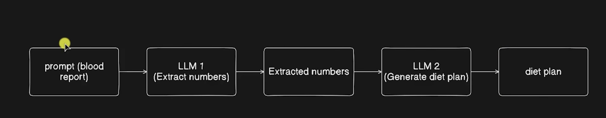

# ai-shopping-assistant

-  install dependencies `uv install`
- it create a `.venv` this create a virtual environment 
- active the virtual env 
    ```
    python3 -m venv .venv
    source .venv/bin/activate
    PYTHONPATH=src python -c 'from ai_shopping_assistant import main; main()'
    ```
- Create a notebook to call llm
    `python -m notebook`

# 2. Health Analysis 
workflow 


## Run the health analysis app

From the project root:

```bash
uv run streamlit run 2_health_analysis/streamlit_app/app.py
```

The app accepts a `.txt` blood-work report or pasted text. Set `GROQ_API_KEY` in `.env` before analyzing a report.


## Create a streamlit app 

run it 

`.venv/bin/streamlit run 2_health_analysis/streamlit_app/app.py --server.headless true`