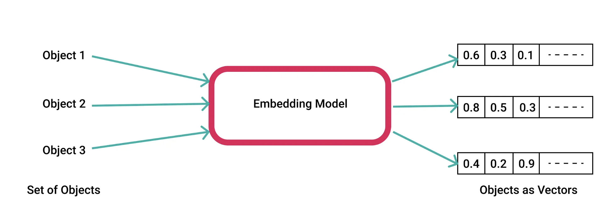
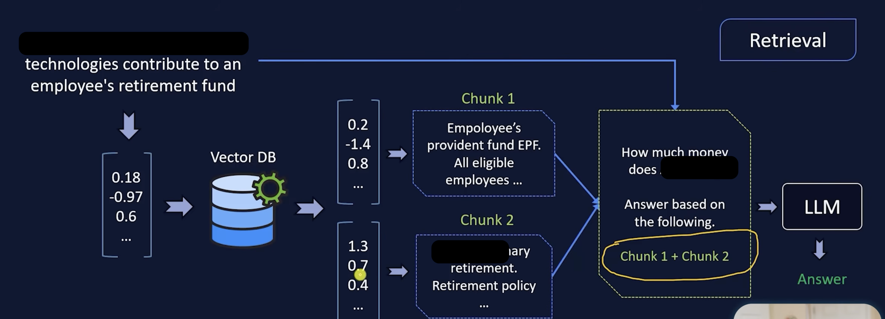

# ai-shopping-assistant

-  install dependencies `uv install`
- it create a `.venv` this create a virtual environment 
- active the virtual env 
    ```
    python3 -m venv .venv
    source .venv/bin/activate
    PYTHONPATH=src python -c 'from ai_shopping_assistant import main; main()'
    ```
- Create a notebook to call llm
    `python -m notebook`

- run streamlit app 
` uv run streamlit run 10_ai_assistant_project/app.py`

# 2. Health Analysis 
workflow 


## Run the health analysis app

From the project root:

```bash
uv run streamlit run 2_health_analysis/streamlit_app/app.py
```

The app accepts a `.txt` blood-work report or pasted text. Set `GROQ_API_KEY` in `.env` before analyzing a report.


## Create a streamlit app 

run it 

`.venv/bin/streamlit run 2_health_analysis/streamlit_app/app.py --server.headless true`

# RAG 
example of HR doc to provide context for retirement benefit

if its a 3000 page doc then you will reach context window , 

alternate approach is to make it fixed \ size chunks and store it in vector database

how do you find the text meaning?

`Embedings` is a process of converting text into a vector such that it can represent its meaning 

search based on meaning not the exact text 
use can use verity of models to create embedings

- Commercial / Proprietary APIs
    - OpenAI Text Embedding 3: Versatile, high-performance general models (text-embedding-3-small and text-embedding-3-large) with flexible dimension-reduction capabilities.
    - Cohere Embed: Strong multilingual and retrieval performance, often paired natively with reranking steps.
    - Voyage AI: Specialized models (voyage-3-large) optimized for high-accuracy domain retrieval, code, and technical documentation.
- Open-Source / Self-Hosted Models
    - BGE-M3 (BAAI): A versatile multilingual model supporting dense, sparse, and multi-vector retrieval across over 100 languages.
    - Nomic Embed: Efficient open-source text embedding models tailored for local workloads, edge devices, and large-scale vector memory.
    - All-MiniLM-L6-v2: A lightweight, highly resource-efficient sentence transformer ideal for fast local embedding tasks.
    - Jina Embeddings: Optimized for long-context windows and advanced late-chunking strategies over massive text blocks.




Vector Databases 

- Chroma DB 
- Qdrant 
- Mivus

 ## Retrieval



## Chroma DB 
it uses all-MiniLLM-L6-V2 byfeault to create embedings 

